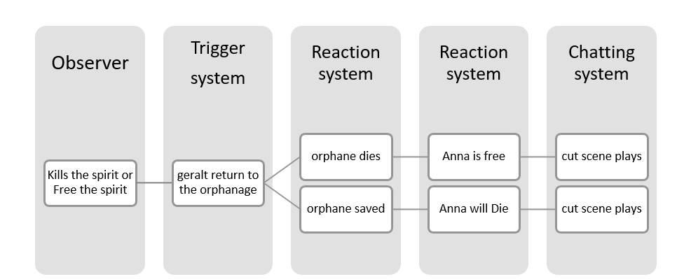
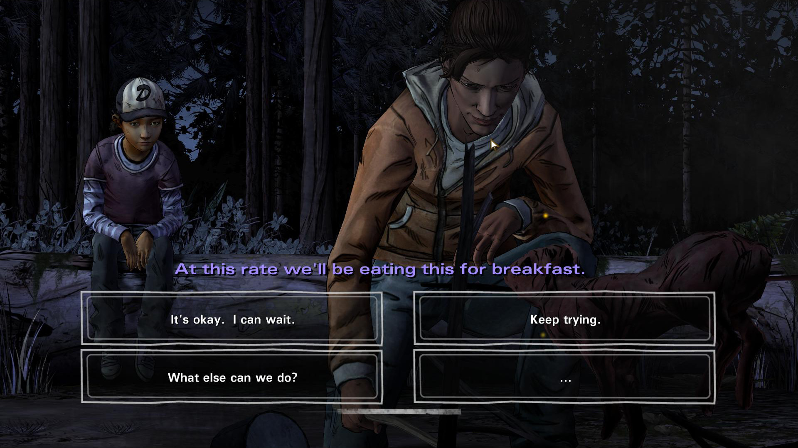
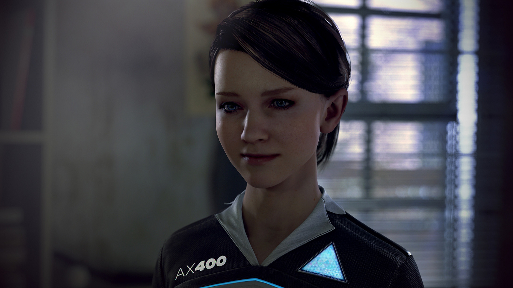
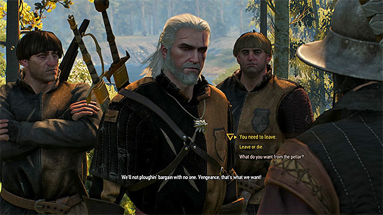
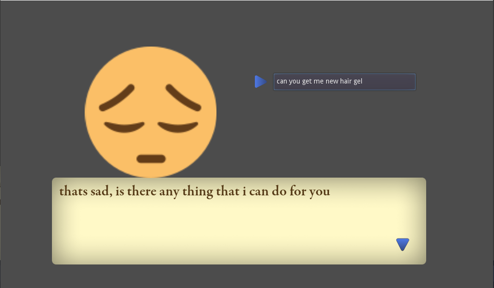

#### A bit of background

I was working on my 2D slice of life game (a game about character relationships and stuff, not a dating sim but along those lines).

So basically working on a dialog system for the game I realize there is not a lot of really good resources for it. Other than a hand full of add-on that are confusing to use or doesn’t have many features.

I realize it was best if I just build my own dialog system from scratch. The problem is there are no many tutorials on functional dialog systems let alone a good dialog system. After a month of going through blogs and GDC video stuff. I have collected some information about it.

So I thought why not share this with the community.

### Content

- [First you should ask yourself why you should invest time in a good dialog system](#first-you-should-ask-yourself-why-you-should-invest-time-in-a-good-dialog-system)
	- [👍 Why you should?](#-why-you-should)
	- [👎 Why you shouldn’t?](#-why-you-shouldnt)
- [Well there is another important thing understanding what is a dialog system?](#well-there-is-another-important-thing-understanding-what-is-a-dialog-system)
	- [I think a good example of this is Witcher 3: (watch gamepaly)](#i-think-a-good-example-of-this-is-witcher-3-watch-gamepaly)
- [Now that we have dealt with why and what we should talk how we are going to make it?](#now-that-we-have-dealt-with-why-and-what-we-should-talk-how-we-are-going-to-make-it)
	- [🎊 Now the fun part.🎊](#-now-the-fun-part)
		- [Waterfall type](#waterfall-type)
		- [Hub Type](#hub-type)
		- [Hybrid ⭐ (my preferred one)](#hybrid--my-preferred-one)
		- [Parser-Driven](#parser-driven)
		- [Other key components of a good dialog system:](#other-key-components-of-a-good-dialog-system)
	- [Building your own tool?](#building-your-own-tool)
		- [Why I am using JSON file why not “If statements”?](#why-i-am-using-json-file-why-not-if-statements)
		- [Like the dialog node has](#like-the-dialog-node-has)
- [Snippets](#snippets)
	- [load character:](#load-character)
	- [load dialogs:](#load-dialogs)
	- [load choices:](#load-choices)
	- [show choices:](#show-choices)
	- [Flowmap](#flowmap)

[some stuff can be wrong as there is no definite answer to all these but I will try to link stuff]

## First you should ask yourself why you should invest time in a good dialog system

This is subjective but there are few key points.

### 👍 Why you should?

The answer is simple:

- It offers re-play value
- It is a great way to share lore
- It is a key component of a good RPG
- It’s a great way to tell a story
- A good dialog system can handle a lot of boring stuff like tutorials
- All most all indie game offer some kind of dialog system and you should too

### 👎 Why you shouldn’t?

There are quite a lot:

- Dialog system requires a lot a works (bulling assets, writing dialogs etc.)
- If not done will it is just annoying
- It get super confusing super-fast
- Usually making a sequel is nearly impossible only hard reboot can be done.
- There are some genre that just don’t need a dialog system

## Well there is another important thing understanding what is a dialog system?

You may think it’s a stupid question, a dialog system is just a way share info either in the form of text, audio or video (cinematic).

This is a really good answer but not very help full. In real life _(I hope everyone remember what if like to talk in real life)_ when to people talk a lot more thing are happening.

🌟 We first build an opinion about a person based on our **past experiences** and **observation**, so based on those **opinion** we either **respond to a conversation** or **start a new one** or **never talk again**. You now have clear picture of what a dialog system should look like. **Let’s elaborate**

A good dialog system contains these components: (btw I come up with few of the names so it may sound stupid) discussed in more detail [here](#components-dialog-system)

1. 🕵️ **_Observer_** : Something that tracks the actions, choices and possessions of player (long term memory )like a hybrid “Save” system.

basically has to store importation about player actions. it can be as minute as a number of times a key pressed to a massive action like deletion of file or completion of quest.

2. 🔥 **_Reaction system (soft-core [“nemesis system”](https://www.youtube.com/watch?v=Lm_AzK27mZY))_**: something that generates a opinion (feeling or emotions or sets of dialog) from player’s past actions, choices and possessions

so basically all the data collected by the observer is processed on based on those the dialogs/events are dynamically changed

3. 🚩 **_Trigger system/mechanic_**: “whenever a player fulfills any criteria world/NPC provide a response against that specific criteria”.

It can be a **state machine, button, Area2D, ray cast** or **anything**. It just has detects small actions.

_[I know that bark mechanic means NPC shouting in the background but I have read somewhere that it’s actually borrowed from the state machine or something like that. There is no clear definition heck I’m not even sure if something like this even exists or not.]_

4. 📣 **_Chatting system_**: basically the outputs the data produced by the Reaction system mixed with the pre-made dialog templates like the audio, text and cut scene

for example: you have killed `[x number of monsters]` you disserve this this sword.

where `[x number of monsters]` will get replaced with the actual number of the monster.
ts is extremely difficult to pull off something like this specially when the dialog are extremely complex.

I will show my solution to this

### I think a good example of this is Witcher 3: [(watch gamepaly)](https://www.youtube.com/watch?v=GrEX4_UVb8A)

<br>


[](http://www.youtube.com/watch?v=GrEX4_UVb8A "Witcher 3: The Whispering Hillock (click to watch gameplay)")

In early game in the Ladies of the Wood quest line if you choose to kill the free the spirit in the [Quest: The Whispering Hillock](https://witcher.fandom.com/wiki/The_Whispering_Hillock) when Geralt return to the ladies of the wood he will find that the orphans have been eaten by the crones then a cut scene plays if you release the spirit the player the crone would not have killed the orphans but Anna will be turned into a water hag or something


<div style="text-align: center"> Simple diagram to show the working </div>

## Now that we have dealt with why and what we should talk how we are going to make it?

Well now that we know what is a dialog system we can build it easily, right? Wrong.

There are small stuff missing, like a dialog system can be linear or branching. I will quickly discuss the first one as the second one is really complex.

***Non branching system** need no explanation it is simple and linear you just add break point b/w the story and connect them with the quests or events.*

### 🎊 Now the fun part.🎊

So there are three type of branching system (based on *gamasutra.com*):

#### Waterfall type

it is the simplest of the branching system you go through a path and based on which you will get an ending out of many possible ones.

- It is best suited for a linear game.

*Best example is [walking dead](https://www.youtube.com/watch?v=Tilvxc1LPrM&list=PLYH8WvNV1YEnMqMEIZV4F7NLC9C-J5-Si);*

[](https://www.youtube.com/watch?v=Tilvxc1LPrM&list=PLYH8WvNV1YEnMqMEIZV4F7NLC9C-J5-Si)

i think almost every own knows that your choices in the game doesn't matter. So this should be a really bad example yet i put it as a best example.

*Before you pull out your pitch forks let me clarify my point.*

The thing is this game's **narrative is linear**, not the **dialog system**. Path leads to an different consequences it's just that the beginning and the end are same.

**another example is**: **Going from your home to your school**. even though the destination and the beginning are same but you can take multiple path to the school you can first visit a shop ot take a bus or a train. The path will be different in each case.

**Another great example is** [**Detroit Become Human**](https://www.youtube.com/watch?v=m51FsEHBlwA&list=PLLBQLDFWnxtVJfjq6wrG04h0gJEguLDy2).

[](https://www.youtube.com/watch?v=m51FsEHBlwA&list=PLLBQLDFWnxtVJfjq6wrG04h0gJEguLDy2)

*(you might feel a bit conflicted as how am I comparing these two game as they are so different, Just bare with me by end of this you will have a really good picture of what i'm trying to say)*

Other than the fact that both of them were trying hard to shove same philosophy(humanity and empathy) down your troat, there are quite a bit of other similarities between them.

- Both of the game had linear gameplay even though the narrative was branching.
- both of them fall under the interactive media category rather than a game (a pseudo-game to be honest)

so if you remember our last example lets spice it a bit. if on the way to your school it started raining and you didn't reached the school

#### Hub Type

It is a hub based system basically when you interact with an NPC a bunch of options will be given with a set dialogs once the dialogs are exhausted you will return back to the main option menu.

- Best suited for open world design.

I don’t know any good example may be the [fallout 3](https://www.youtube.com/watch?v=MqR8tmHmY48)?

[_28.jpg)](https://www.youtube.com/watch?v=MqR8tmHmY48)

The game has a lot more stuff like karma system and environmental story telling.

#### Hybrid ⭐ (my preferred one)

it is combination of both **Hub type** and **Waterfall type**. Like in the **Witcher 3** the 🟨 **yellow dialogs** are **Waterfall** type whereas the ⬜ **white one** was **Hub type**.

- This is best for open world design



#### Parser-Driven

There is also a machine learning based dialog system called **Parser-Driven**:

So basically it takes the written input of the player and translate it into computer understandable instruction and return some dialog like a chat bot. It is rare but it does exists.

**Example**: [Event [0]](https://www.youtube.com/watch?v=bCJw4hQkPj4) is kind an example *I haven’t played the game so ya..??*

[![event [0]](event-zero-870x489.jpg)](https://www.youtube.com/watch?v=bCJw4hQkPj4)

#### Other key components of a good dialog system:

- Time constrains ⌚
- Color distinction (separate the imp dialog with non-imp) 🎨
- Quest and action should effect the dialogs. 📰
- Add personality to dialog 🎭
- NPC to NPC relation and Player to NPC relation 🧑‍🤝‍🧑
- And may more

### Building your own tool?

There is no best way to code a dialog system just like a climbing system you can come up with your own idea better than mine. Again these are just ideas.

if you are building a really massive game then it is not a bad idea to learn C++/gd native and build your game using SQLite. A lot of indie studios develop their own tool from scratch. I think the studio that made ["Night in the Woods"](https://secretlab.games/blog/2017/11/14/how-night-in-the-woods-uses-yarn-spinner) develop their own tools to handle dialogs caller [Yarn Spinner](https://github.com/YarnSpinnerTool/YarnSpinner)

#### Why I am using JSON file why not “If statements”?

The answer is simple:

- You can share JSON file with your team.
- You can switch engines without fear of losing data
- You can build external software for your writer or you self to quickly write a story and import it into the game.

<br>


The structure of the **JSON file** was very simple:
This works very simply: each node can be either of the three type i.e. `Character`, `Dialog`, and `Option` Each of these nodes have their respective options or *keys if you say so*.

#### Like the dialog node has

- `say` : visible text
- `emotion`: animation
- `add item`: add item after dialog is completed

The nodes are connected through what is call id so basically a `dialog: 1` with `ID: 1`is linked to `option: 1`

You can build a loop using this method to achieve a **Hub based** branching dialog system:
Just build a simple dialog parser and you are good to go:

heres how my game looks like:

<div style="text-align: center"> the simple working branching dialog system:-</div>


So basically the first 3 option will lead to the main root option, this is because the option node contains `ID: 1` which co responds to the `dialog: 1`
Respective dialogs are triggered and expressions/animations are visible.

<div style="text-align: center"> conciquences:-</div>




<br>

<br>


For me the `Debugger` is the `Observer` and the script at the `Dialog Manager` is the Reaction system

## Snippets

it's an old bit of code now that I look at it I feel like a ton of things can be improved.

### load character:

this basically loads the character and in the scene

```gd
func load_character():
   import_character = story["character"]["character"]
   character = load(import_character).instance()
   add_child(character)
   emotion = character.get_node("TextureRect/AnimationPlayer")

```

### load dialogs:

dialog index is just the number of dialogs in the list to show before showing the options. `text_diaplay_rate_logic()` is just the speed of dialog by which it will show up on the screen in simple `tween` animation. (didn't work well for me)

[this part of the code was borrowed from [Emilio](https://www.youtube.com/channel/UC9DR22-qohBDtZ74R3FxOZg)]

```gd
func load_dialogue():
	if dialog_index < story["dialogue"][dialogue_ID]["say"].size():
		finished = false
		$Option.visible = false
		$"DialogBox/RichTextLabel".bbcode_text = story["dialogue"][dialogue_ID]["say"][dialog_index]
		$"DialogBox/RichTextLabel".percent_visible = 0
		text_display_rate_logic()
		$DialogBox/Tween.interpolate_property(
			$DialogBox/RichTextLabel, "percent_visible", 0, 1, text_display_rate,
			Tween.TRANS_LINEAR
		)
		$DialogBox/Tween.start()
		show_choices()
	dialog_index += 1
```
### load choices:

this basically load the choices, `option_ID` is the `ID` of the next option branch (`y`) using a simple for loop I add options to the dialog

```gd
func load_choices():
	options_ID = story["dialogue"][dialogue_ID]["ID"]
	var y = story["options"][options_ID]["options"]
	var buttons = $"Option/VBoxContainer".get_children()
	var z = 0

	for x in y:
		check_for_option_requirments(x)         # useless part
		buttons[z].text = story["options"][options_ID]["options"][str(x)]["say"]
		z = z + 1
```

### show choices:

this basically makes sure that the options are only visible after the dialog is complete and any button(buttons[key]) that doesn't have a choice get removed(not visible)

```gd
func show_choices():
	if dialog_index < story["dialogue"][dialogue_ID]["say"].size():
		$Option.visible = false
	else:
		load_choices()
		location = "option1"    # location to go (arrow besides the option)
		go_to_the_choices()     # animated arrow besides the option

		var buttons = $"Option/VBoxContainer".get_children()
		var z = 0
		var key = 0

		for x in buttons:
			buttons[z].visible = false
			z = z + 1
		for i in story["options"][options_ID]["options"].keys():
			buttons[key].visible = true
			key = key + 1
		$Option.visible = true
		$"Option/VBoxContainer/Button".grab_focus()
```
### Flowmap

This just a flow map of how stuff works if it doesn’t make any sense it is okay, as it doesn’t have. I think you have a good understanding of how the thing works and you can build your own tools and make a good dialog system.

>note that the flow chart map was made just before abandoning it


Also, I'm am working on a new dialog system based on what I have learned from this tiny experiment. hope it turns out to be good.

Keynotes before I bid my farewell:

1. a good dialog system is built upon a great save system
2. Have a engaging story is as important as a good dialog system

Reference and reading material:

1. https://www.youtube.com/watch?v=chf3REzAjgI
2. https://www.youtube.com/watch?v=wj-2vbiyHnI
3. https://www.gamasutra.com/view/feature/132116/defining_dialogue_systems.php?page=1
4. https://www.youtube.com/watch?v=kkLqW8WhCgg&t=4s
5. https://www.youtube.com/watch?v=Qh3U2cbH8DM
